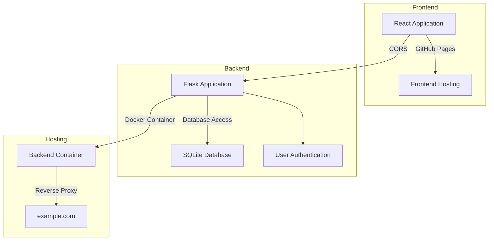

# Fullstack Application Overview

## Overview

This document provides a detailed rundown of the stack used for this application, including the frontend, backend, and hosting configurations.

## Stack Components

### Frontend

- **React Application**: The frontend is built using React.
- **Frontend Hosting**: The React application is hosted on GitHub Pages.

### Backend

- **Flask Application**: The backend is built using Flask.
- **SQLite Database**: The backend uses SQLite for database management.
- **User Authentication**: Handled by Flask, including session management and password hashing.

### Hosting

- **Docker Container**: The Flask application runs inside a Docker container using gunicorn.
- **Reverse Proxy**: The Docker container is reverse proxied to a subdomain using ngninx and cloudflare name servers.

### CORS

- **Cross-Origin Resource Sharing (CORS)**: CORS is configured to allow the React application hosted on GitHub Pages to interact with the Flask backend hosted on my subdomain.

## Mermaid Diagram

